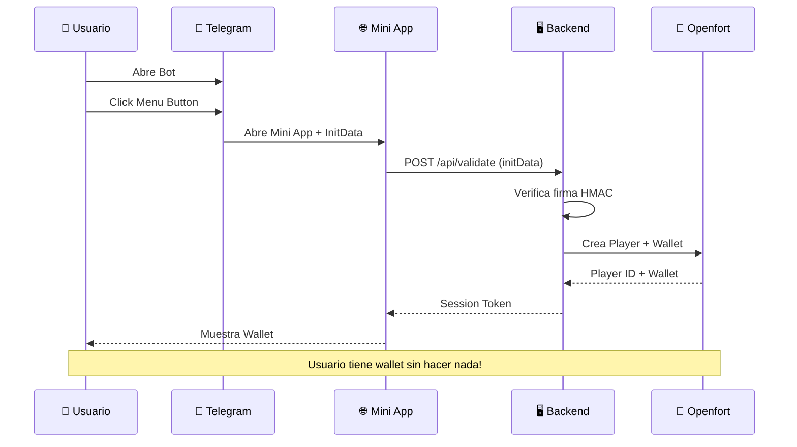
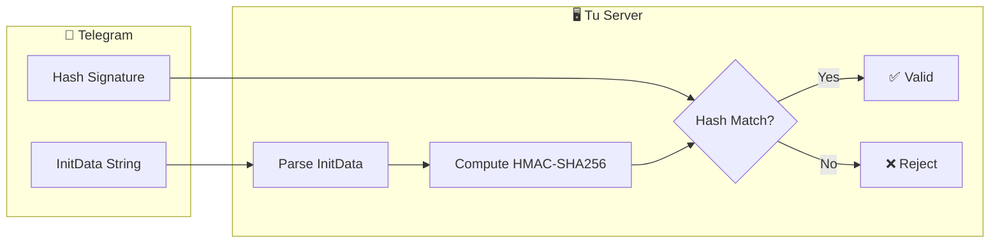
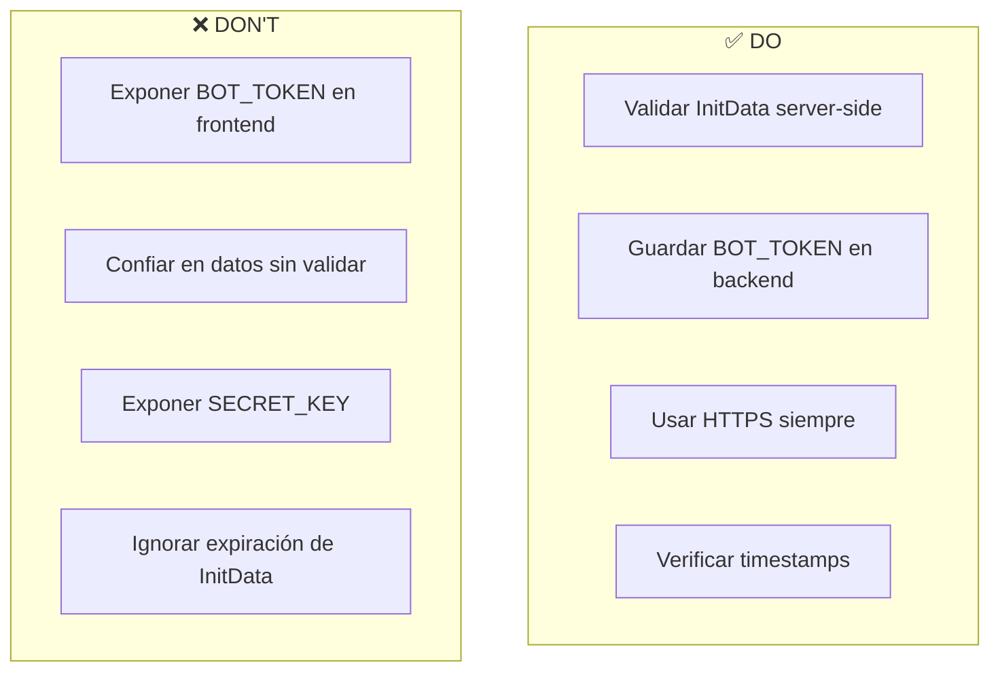

# Openfort Telegram Mini App

[](https://opensource.org/licenses/MIT)
[](https://nextjs.org/)
[](https://core.telegram.org/bots/webapps)
[](https://openfort.xyz)

Construye Telegram Mini Apps con creación automática de wallets Web3 usando Openfort. Autenticación segura con InitData de Telegram.

## 🎥 Video Tutorial

Este repositorio acompaña el video tutorial de CodaLabs:
**[Openfort + Telegram: Mini Apps con Wallets Automáticas](https://youtube.com/@CodaLabs)**

## ✨ Características

- 🤖 **Integración Telegram** — Mini App nativa
- 🔐 **InitData Validation** — Autenticación segura server-side
- 💰 **Wallets Automáticas** — Sin registro, sin seed phrases
- 📱 **Multiplataforma** — iOS, Android, Desktop
- ⚡ **Zero Fricción** — El usuario abre y ya tiene wallet

## 🏗️ Arquitectura

```mermaid
flowchart TB
    subgraph Telegram["📱 Telegram"]
        Bot[Bot con Menu Button]
        MiniApp[Mini App WebView]
    end
    
    subgraph Backend["🖥️ Next.js Backend"]
        Validate[/api/validate]
        Wallet[/api/wallet]
    end
    
    subgraph Services["☁️ Services"]
        OF[(Openfort API)]
    end
    
    Bot -->|Abre| MiniApp
    MiniApp -->|InitData| Validate
    Validate -->|Verificado| Wallet
    Wallet -->|Create Player| OF
    OF -->|Wallet Address| MiniApp
```

## 🔄 Flujo de Autenticación



## 🔐 Seguridad: InitData



## 📁 Estructura del Proyecto

```
openfort-telegram-miniapp/
├── app/
│   ├── page.tsx              # Mini App UI
│   ├── layout.tsx            # Root layout
│   └── api/
│       ├── validate/
│       │   └── route.ts      # InitData validation
│       └── wallet/
│           └── route.ts      # Wallet creation
├── components/
│   └── telegram-wallet.tsx   # Wallet display
├── lib/
│   ├── telegram.ts           # Telegram utilities
│   └── openfort-server.ts    # Openfort config
├── .env.example
├── LICENSE
└── README.md
```

## 🚀 Quick Start

### Prerrequisitos

1. **Telegram Bot** — Crear via [@BotFather](https://t.me/BotFather)
2. **ngrok** — Para HTTPS local ([ngrok.com](https://ngrok.com))
3. **Openfort Account** — [openfort.io](https://openfort.io)

### 1. Crear Bot en Telegram

```
1. Abre @BotFather en Telegram
2. Envía /newbot
3. Sigue las instrucciones para nombrar tu bot
4. Guarda el BOT TOKEN
5. Envía /setmenubutton
6. Selecciona tu bot
7. (La URL la configuramos después)
```

### 2. Clonar y Configurar

```bash
git clone https://github.com/CodaLabs-xyz/openfort-telegram-miniapp.git
cd openfort-telegram-miniapp
npm install
cp .env.example .env.local
```

### 3. Variables de Entorno

```env
# Telegram (de BotFather)
TELEGRAM_BOT_TOKEN=123456:ABC-DEF...

# Openfort (de Dashboard)
OPENFORT_SECRET_KEY=sk_live_...
NEXT_PUBLIC_OPENFORT_PUBLISHABLE_KEY=pk_live_...
```

### 4. Desarrollo Local

```bash
# Terminal 1: Next.js
npm run dev

# Terminal 2: ngrok tunnel
ngrok http 3000
```

### 5. Configurar Menu Button

1. Copia la URL HTTPS de ngrok (ej: `https://abc123.ngrok.io`)
2. En BotFather: `/setmenubutton`
3. Selecciona tu bot
4. Pega la URL de ngrok

### 6. Probar

1. Abre tu bot en Telegram
2. Toca el Menu Button
3. ¡La Mini App abre con tu wallet! 🎉

## 🔧 API Endpoints

### POST /api/validate

Valida InitData de Telegram y crea sesión.

```typescript
// Request
{
  initData: "query_id=...&user=...&hash=..."
}

// Response
{
  valid: true,
  user: {
    id: 123456789,
    first_name: "John",
    username: "johndoe"
  },
  sessionToken: "jwt_token_here"
}
```

### POST /api/wallet

Crea o recupera wallet para el usuario.

```typescript
// Request (con session token)
{
  telegramUserId: "123456789"
}

// Response
{
  playerId: "pla_...",
  walletAddress: "0x..."
}
```

## 📚 Validación de InitData

```typescript
// lib/telegram.ts
import crypto from 'crypto';

export function validateInitData(
  initData: string, 
  botToken: string
): boolean {
  const params = new URLSearchParams(initData);
  const hash = params.get('hash');
  params.delete('hash');
  
  // Sort and create check string
  const checkString = [...params.entries()]
    .sort(([a], [b]) => a.localeCompare(b))
    .map(([k, v]) => `${k}=${v}`)
    .join('\n');
  
  // Compute HMAC
  const secretKey = crypto
    .createHmac('sha256', 'WebAppData')
    .update(botToken)
    .digest();
    
  const computedHash = crypto
    .createHmac('sha256', secretKey)
    .update(checkString)
    .digest('hex');
  
  return computedHash === hash;
}
```

## ⚠️ Seguridad



**Reglas de oro:**
- ❌ **NUNCA** expongas `TELEGRAM_BOT_TOKEN` en el frontend
- ❌ **NUNCA** expongas `OPENFORT_SECRET_KEY` en el frontend
- ✅ **SIEMPRE** valida InitData en el servidor
- ✅ **SIEMPRE** verifica que InitData no haya expirado

## 🐛 Troubleshooting

<details>
<summary><b>Mini App no abre</b></summary>

- Verifica que la URL sea HTTPS
- Revisa que ngrok esté corriendo
- Confirma que el Menu Button esté configurado

</details>

<details>
<summary><b>InitData validation fails</b></summary>

- Verifica el BOT_TOKEN (sin espacios extra)
- Asegúrate de que InitData no haya expirado
- Revisa el parsing de la query string

</details>

<details>
<summary><b>Wallet no se crea</b></summary>

- Verifica OPENFORT_SECRET_KEY
- Revisa logs del servidor
- Confirma que el player se creó en Openfort Dashboard

</details>

## 🔗 Recursos

- [Telegram Mini Apps Docs](https://core.telegram.org/bots/webapps)
- [Documentación Openfort](https://openfort.io/docs)
- [BotFather](https://t.me/BotFather)
- [ngrok](https://ngrok.com)
- [Serie de Videos CodaLabs](https://youtube.com/@CodaLabs)

## 📄 Licencia

Este proyecto está bajo la licencia MIT. Ver [LICENSE](LICENSE) para más detalles.

---

<p align="center">
  Made with ❤️ by <a href="https://github.com/CodaLabs-xyz">CodaLabs</a>
</p>
